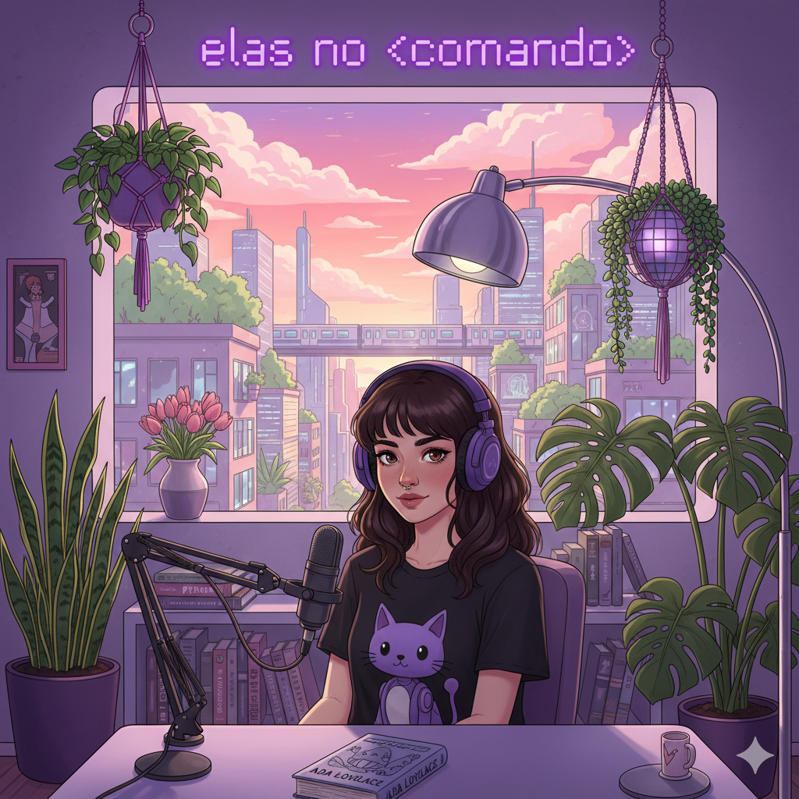
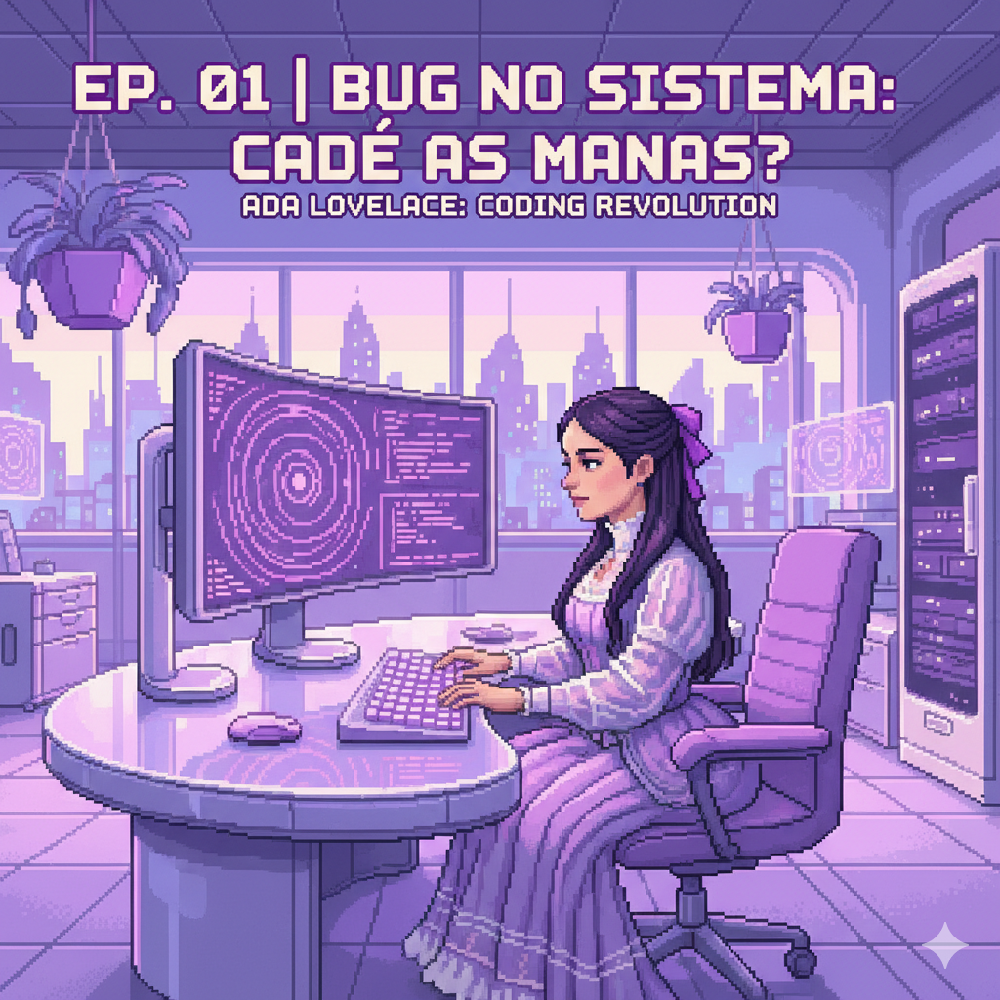
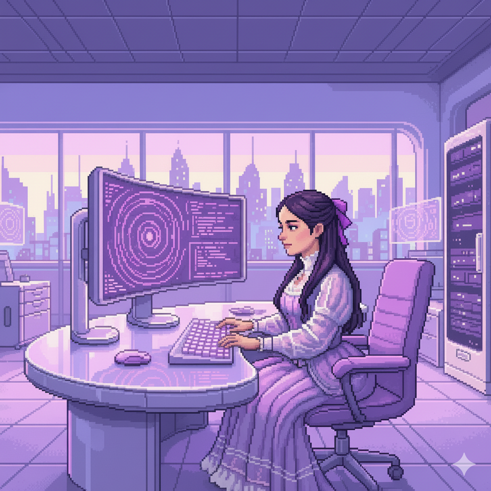
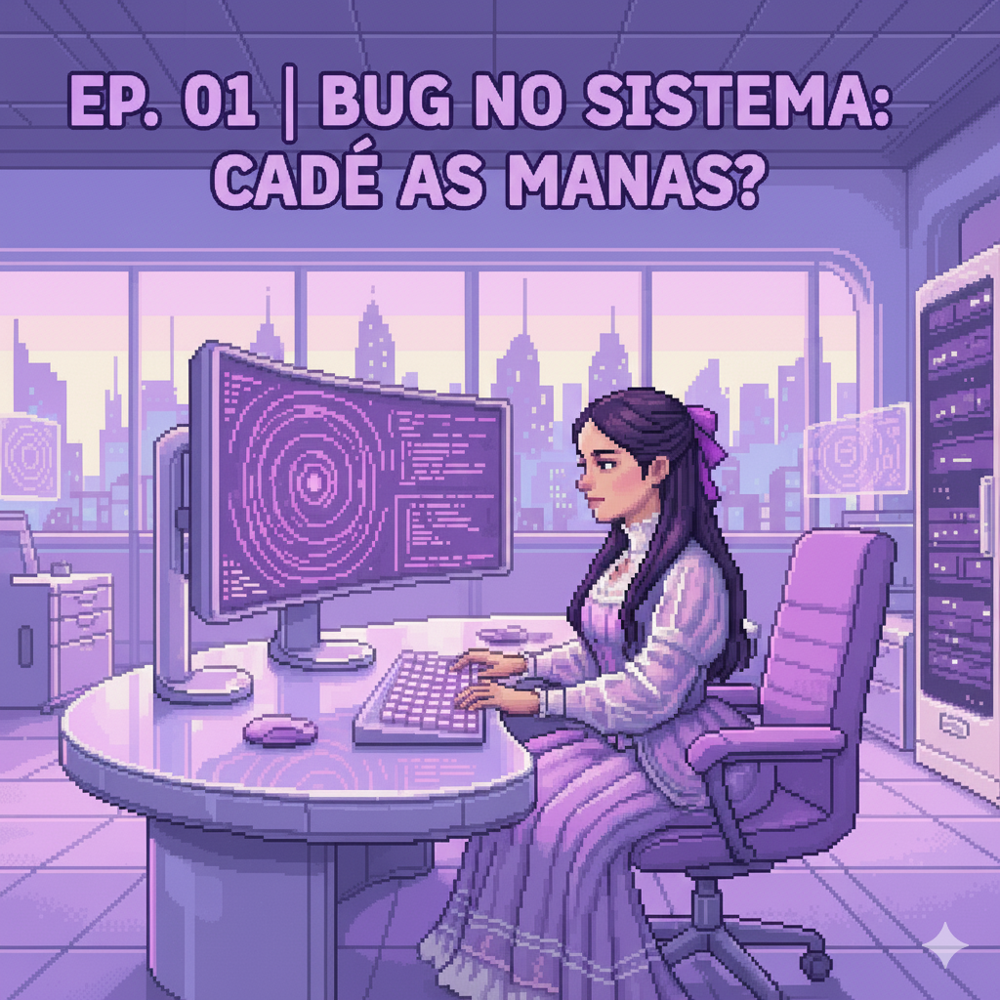
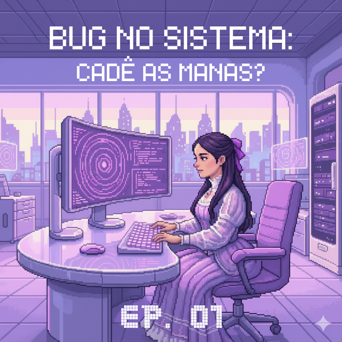

    preview do podcast

    <audio src="output/podcast_editado.MP3" controls title="Podcast editado"></audio>

# Projeto Podcast Gerado por I.A.s

Projeto desenvolvido com o objetivo de criar um podcast do zero por meio de Inteligência Artificial Generativa, com ênfase no domínio da engenharia de prompts. Esta iniciativa foi concluída durante o bootcamp "Fundamentos de IA Generativa", uma colaboração entre a DIO e a Universia.

Para a realização do podcast, a criação de um visualizer não era exigida pelo curso. Assim, criei também um visualizer para praticar o uso de uma ferramenta de IA generativa de vídeo e o processo de edição.

## 💻 Tecnologias utilizadas no projeto

- [ChatGPT](https://chat.openai.com/) 
- [Gemini AI](https://gemini.google.com/)
- [ElevenLabs](https://beta.elevenlabs.io/)
- [Canva](https://www.capcut.com/pt-br/)
- [Pippit](https://www.pippit.ai/)
- [Capcut](https://www.capcut.com/)

## ✨ Como foi feito ?

- O roteiro foi gerado através do Chat-GPT;
- O áudio foi produzido através da ferramenta "Text to Speech" da ElevenLabs;
- As artes da capa do podcast e da capa do episódio foram criadas pela ferramenta Nano Banana do Gemini AI;
- A criação do vídeo para o visualizer foi criado pelo Pippit;
- A edição de áudio e visualizer foram feitas através do Canva;

## 📚 Materiais

- [Notion Template](https://www.notion.so/PAS-Podcast-AI-Studio-2822f436f1398060a1c3e28acbb46dcb?source=copy_link)

## 🛠️ Instruções de execução

### Roteirista de podcast

Abaixo descrevi os prompts criados para realizar o projeto do podcast, todos eles foram elaborados pela ferramenta da OpenAI Chat-GPT.

#### Criação de título do podcast

**Prompt**

{TAREFA}

Você é uma roteirista de podcast que tem como tema “**mulheres na tecnologia**”. Crie de forma criativa e inovadora, 5 nomes para este podcast levando em consideração principalmente o empoderamento feminino no ambiente tecnológico.

**Sobre o podcast:**

Esse podscast é apresentado por uma mulher carismática e que traz em seus episódios uma convidada especial que é especialista dentro de alguma área da tecnologia. Esse podcast têm como objetivo trazer debates relevantes sobre o protagonismo de mulheres na tecnologia e os desafios enfrentados dentro do mercado tecnológico.

{REGRAS}

- O nome deve remeter ao universo feminino e fazer referência a tecnologia;
- O nome deve ser chamativo principalmente para o público feminino brasileiro;
- O nome deve ser curto, divertido, leve e inovador;

{REGRAS NEGATIVAS}

- O título não deve conter palavras em inglês ou estrangeiras;
- Não deve utilizar as seguintes palavras: tecnologia, mulher, feminino, empoderamento, rosa;
- Não deve remeter apenas a tecnologia ou apenas à mulheres.

---

O título escolhido foi: **elas no \<comando\>**, pois transmite liderança e protagonismo feminino.

---

#### Criação de um roteiro

**Prompt:**

{TAREFA}

Você é uma mulher roteirista do podcast “elas no < comando >”, que tem como tema “**mulheres na tecnologia**”. Crie um roteiro para o podcast contendo:

[INTRODUÇAO]

[ASSUNTO1]

[ASSUNTO2]

[FINALIZAÇÃO]

[DESPEDIDA]

{REGRAS}

- no bloco [INTRODUÇÃO] substitua por uma introdução alegre e divertida, agradeça de forma informal e gentil a DIO, por contribuir compartilhando seu conhecimento para que o Podcast exista.
- no bloco [ASSUNTO1] substitua por um assunto que faça referência a Ada Lovelace, sua chará, ser uma mulher protagonista na Computação, a redução da presença feminina na tecnologia com o passar dos anos e a importância das mulheres encontrarem referências de mulheres na tecnologia para enfrentar esse desafio.
- no bloco [ASSUNTO2] substitua por um assunto sobre como as empresas de tecnologia podem contribuir para que isso possa ser superado atualmente, utilize exemplos;
- no bloco [FINALIZAÇÃO] substitua por uma frase inspiradora que tenha relação com o tema do episódio
- no bloco [DESPEDIDA] substitua por uma despedida calorosa, convide quem gostou do episódio a compartilhar com amigos e amigas e fale que toda semana tem episódio.
- use termos acessíveis;
- O podcast vai ser apresentado somente por uma pessoa, chamada Ada.
- O podcast deve ser curto e seu conteúdo deve ser apresentado com leveza

{REGRAS NEGATIVAS}

- Não use termos técnicos
- Não use palavras ou termos que crie uma atmosfera pesada sobre os assuntos
- Não ultrapasse 2 minutos de duração

---

**Resposta ao prompt**:

[INTRODUÇÃO]

Narradora: Oi, gente! Sejam muito bem-vindas e bem-vindos a mais um episódio do **elas no comando**. Eu sou a Ada e tô muito feliz de ter você aqui comigo! 💜

Antes de começar, quero deixar um agradecimento especial e cheio de carinho pra galera da **DIO**. Obrigada por compartilhar tanto conhecimento e fazer com que esse podcast seja possível. Vocês são incríveis!

[ASSUNTO 1]

Narradora: Hoje vamos falar de uma mulher que carrega uma história inspiradora: **Ada Lovelace**. Imagina só, no século XIX, quando ninguém falava em computadores, ela já tinha enxergado esse futuro e escreveu o primeiro algoritmo da história. Ou seja, ela sonhou com um mundo que nem existia ainda!

Mas, com o tempo, a presença feminina na tecnologia foi diminuindo. E isso mostra como encontrar referências é essencial. Porque, quando vemos mulheres em destaque nesse espaço, a gente entende que também pode trilhar esse caminho.

[ASSUNTO 2]

Narradora: E aí vem a pergunta: como a gente pode mudar essa realidade hoje?

As empresas de tecnologia podem ser grandes aliadas nesse processo. Por exemplo:

- Criando **programas de mentoria** onde mulheres mais experientes apoiam quem está começando;
- Oferecendo **bolsas de estudo e cursos** voltados especialmente para mulheres que querem entrar no mercado;
- Promovendo **eventos e comunidades internas** para troca de experiências, ajudando a criar redes de apoio;
- E, claro, garantindo que mulheres estejam em **posições de liderança**, porque representatividade importa e inspira.
    
Com atitudes como essas, as empresas ajudam a abrir portas e mostrar que lugar de mulher é onde ela quiser, inclusive na tecnologia!
    
[FINALIZAÇÃO]

Narradora: Porque quando uma mulher abre caminho na tecnologia, ela não caminha sozinha: ela ilumina a trilha pra muitas outras seguirem.

[DESPEDIDA]

Narradora: E é isso, gente! Espero que esse episódio tenha inspirado você. Se gostou, compartilha com as amigas, com os amigos, com todo mundo que você acha que vai curtir ouvir essa mensagem. E não esquece: toda semana tem episódio novo do **Elas no Comando**.

Um beijo grande e até a próxima!

---

#### Criação de um título para o episódio

Aproveitei o mesmo chat que havia gerado o roteiro para criação do título, assim gerando um título do episódio no mesmo contexto de forma mais rápida, evitando refazer o prompt.

**Prompt:**

{TAREFA}

Sugira 5 títulos com subtítulos para esse episódio.

{REGRAS}

- O título deve ser curto
- O título deve estar dentro do contexto do episódio
- O título deve fazer um trocadilho com tecnologia

---

Ao receber a resposta, refinei o prompt para gerar outros títulos interessantes:

- O título deve ser mais curto, descontraído em uma linguagem jovial

O título escolhido foi: "**Bug no sistema: cadê as mulheres?**, com o intuito de chamar atenção do público mais jovem, adaptei essa frase com a gíria "manas" que se refere a mulheres, resultando em: "**Bug no sistema: cadê as manas?**".

---

### Artes do podcast

Para produzir as imagens foi utilizada a Nano Banana do Gemini AI.

#### Criação da capa do podcast

**Prompt:**

**Descrição da personagem**:

Uma mulher jovem e alternativa no estilo lo-fi girl. Têm franja e cabelo ondulado castanho escuro um pouco acima dos ombros, olhos castanhos e um piecing prateado no septo. Usa um headphone roxo e está vestindo uma camisa preta com uma estampa de gato-robô roxo. Está sentada atrás de uma mesa lilás onde há um microfone de podcast e um livro sobre Ada Lovelace.

**Background**:

Um studio bem iluminado e colorido, em tons pastéis de roxo. Há uma planta “espada-de-são-jorge” em um vaso roxo escuro e há uma planta tipo “Jibóia” suspensa em um vaso por macramê na cor roxa. Há uma planta “Costela-de-adão” bem grande no canto direito em frente a uma luminária de chão, moderna prateada, super arqueada até em cima da mulher. Há uma planta suculenta pendente “Rabo de Burro**”** em um vaso que têm o ****formato de disco de discoteca, vintage, suspenso pelo teto na frente da janela no lado direito, ele reflete brilhos do sol. Atrás da mulher, há uma janela onde é possível ver uma cidade no estilo cyberpunk e sustentável com plantas e árvores nos prédios, o céu é um pôr-do-sol em tons rosa e laranja com nuvens no estilo studio ghibli. É possível ver um trem-bala futurista atravessando dois prédios na horizontal, na paisagem distante da janela. Na parte superior da janela há uma placa de neon em tom roxo escrito “elas no \<comando\>” no estilo pixel art. Há uma estante embaixo da janela onde têm livros de programação e tecnologia (JAVA, PYTHON, AI). Essa estante é do tamanho da parte inferior da janela e em cima da estante há um vaso de tulipas rosas.  

**Definições**:

Proporção 1:1. lo-fi aesthetic, cozy podcast studio vibe, studio ghibli inspired, cyberpunk pastel colors, soft lighting, warm atmosphere, cinematic composition, highly detailed digital painting

---

Imagem gerada:

---

#### Criação da capa do EP. 01 | Bug no sistema: cadê as manas?

**Prompt:**

Crie uma capa de podcast em pixel art.

**[Personagem]** Ada Lovelace, ela está dentro de um escritório de tecnologia usando seu computador.

**[Background]** Escritório de tecnologia em tons pasteis de roxo, moderno e iluminado.

---

Imagem gerada:

Refinei o prompt para:

- remova as plantas suspensas

Imagem refinada 01:

Refinei o prompt para:

- adicione o título do episódio: EP. 01 | BUG NO SISTEMA: CADÊ AS MANAS? em pixel art roxa

Imagem refinada 02:

Refinei o prompt para:

- corrija o acento circunflexo "^" da palavra "cadê"

Como a resposta foi a mesma, me deparei com essa limitação da ferramenta ao corrigir o acento circunflexo. Diante disso, busquei outra alternativa utilizando a ferramenta de criação Canva.

Imagem final criada:

---

- 🤖 1. Use os prompts de roteiro no `chagpt`
- 🤖 2. Use os prompts de roteiro gerados pelo chatgpt no  `ElevenLabs`
- 🤖 3. Use os prompts de artes no `midjourney`

## 👨‍💻 Estudante

    
    
&nbsp&nbsp&nbspFelipe Aguiar 
    &nbsp&nbsp&nbsp
    <a 
        href="https://github.com/felipeAguiarCode">
        GitHub
    </a>
    &nbsp;|&nbsp;
    <a 
        href="www.linkedin.com/in/felipe-exe">
        LinkedIn
    </a>
    &nbsp;|&nbsp;

  

---

⌨️ com 💜 por [Felipe Aguiar](https://github.com/felipeAguiarCode)